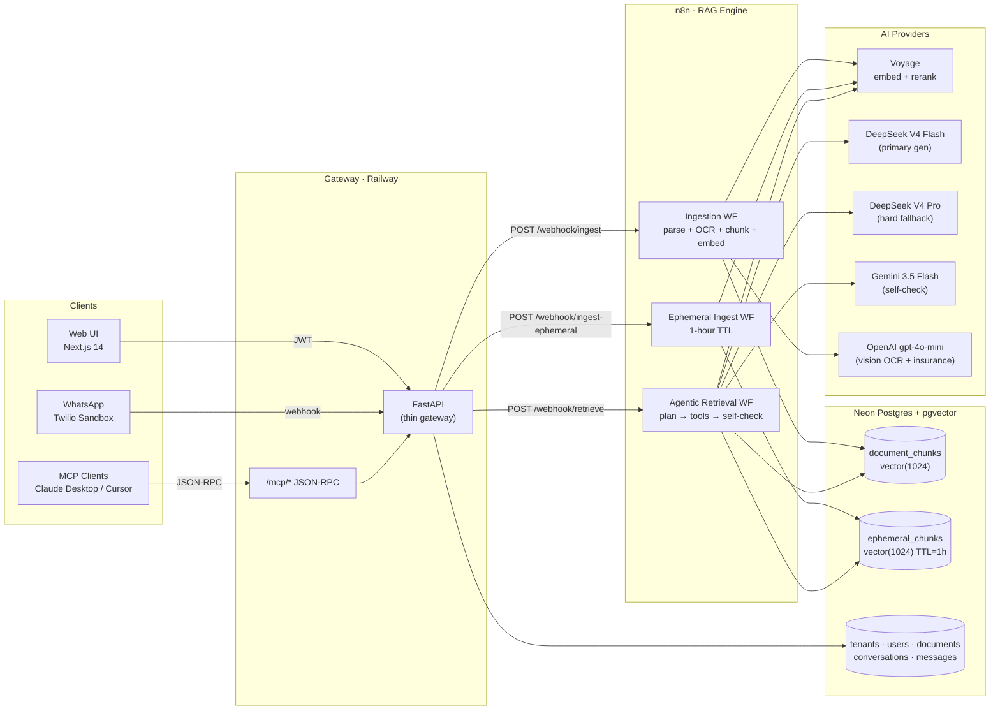

# Grounded Agentic RAG Platform

> Enterprise-grade multi-tenant AI knowledge platform that transforms organizational documents into a trustworthy, citation-backed assistant across Web, WhatsApp, and Slack.

## Overview
Organizations already possess vast amounts of knowledge in the form of manuals, SOPs, onboarding guides, troubleshooting documents, policies, FAQs, and internal documentation. However, finding the right information often requires human experts, resulting in slow support cycles and repetitive responses.

The Grounded Agentic RAG Platform enables organizations to upload their knowledge once and make it instantly accessible through AI-powered self-service channels. Every response is generated from retrieved evidence, accompanied by source citations, and validated through a self-checking pipeline to minimize hallucinations.

The platform is designed for:

Customer Support
Technical Troubleshooting
Employee Onboarding
IT Helpdesk
Product Documentation Search
Enterprise Knowledge Management

## Architecture

The platform follows a decoupled architecture where FastAPI acts as a lightweight gateway and n8n orchestrates all AI workflows.

See [ARCHITECTURE.md](ARCHITECTURE.md) for full diagrams and data flows.

## Design Principle

> **FastAPI acts as a thin gateway.** The API layer never performs LLM operations directly. All AI functionality—including OCR, chunking, embedding generation, retrieval, reranking, grounded response generation, and answer verification—is orchestrated through dedicated n8n workflows. This separation of concerns improves modularity, maintainability, scalability, and operational reliability.

---

## Technology Stack

| Layer               | Technology               |
| ------------------- | ------------------------ |
| Frontend            | Next.js 14, Tailwind CSS |
| API Gateway         | FastAPI                  |
| Workflow Engine     | n8n                      |
| Database            | PostgreSQL               |
| Vector Search       | pgvector                 |
| Object Storage      | Cloudflare R2            |
| Embeddings          | Voyage AI                |
| Reranking           | Voyage AI                |
| Primary Generation  | DeepSeek V4 Flash        |
| Fallback Generation | DeepSeek V4 Pro          |
| Verification        | Gemini Flash             |
| OCR & Vision        | GPT-4o Mini              |

---

## Evaluation Results

The platform was evaluated using a **148-case multi-domain benchmark suite** spanning troubleshooting, onboarding, customer support, technical documentation, and operational knowledge workflows.

| Metric                     | Score         |
| -------------------------- | ------------- |
| Answer Relevancy           | **0.953**     |
| Context Precision          | **0.979**     |
| Context Recall             | **0.923**     |
| Citation Coverage          | **1.000**     |
| Successful Requests        | **148 / 148** |
| Unanswerable Query Refusal | **16 / 16**   |
| Faithfulness               | **0.830**     |

### Key Findings

* Strong retrieval quality across multiple application domains.
* High citation coverage with source-backed responses.
* Reliable refusal of unanswerable questions.
* Excellent context precision and recall.
* Future improvements focus on faithfulness optimization and latency reduction.

---

## Team
| Member                           | Role                                                                                       |
| -------------------------------- | ------------------------------------------------------------------------------------------ |
| **Shantha Suresh M**             | Tech Lead, System Architecture, Infrastructure, Platform Integration & Customer Onboarding |
| **Keshav Kumar**                 | Backend Foundations, Authentication & Core Services                                        |
| **Karthic V**                    | Document Management APIs, Admin APIs & Cloudflare R2 Integration                           |
| **Tushar Srivastava**            | Unified Messaging, Slack & WhatsApp Integration                                            |
| **Kumari Priyanka**              | n8n Ingestion Pipeline                                                                     |
| **Shreya Shrivastava**           | Agentic Retrieval, RAG & Generation Pipeline                                               |
| **Ritika Gupta**                 | Frontend Admin Portal & API Integration                                                    |
| **Joy Das**                      | Frontend Chat Portal, UI Integration, Documentation & Platform Integration                 |
| **Himanshu Arora**               | Evaluation, Testing & Microsoft Teams Integration                                          |
| **Yashas H M**                   | Evaluation, Reporting & Quality Assurance                                                  |
| **Harshit Agarwal**              | WhatsApp Bot Integration                                                                   |
| **Banda Venkata Bhava Haranadh** | Ephemeral Session RAG & Temporary Knowledge Store                                          |

## Documentation
- [CLAUDE.md](CLAUDE.md) — AI assistant instructions + project overview
- [PROJECT_SPEC.md](PROJECT_SPEC.md) — Goals, scope, success criteria
- [ARCHITECTURE.md](ARCHITECTURE.md) — System design, data flows, DB schema
- [SKILLS.md](SKILLS.md) — Platform capabilities reference
- [TEAM_WORKFLOW.md](TEAM_WORKFLOW.md) — PR rules, standup, branching
- [specs/openapi.yaml](specs/openapi.yaml) — Full API contract
- [specs/MODULE_SPEC_M*.md](specs/) — Per-member module specs
